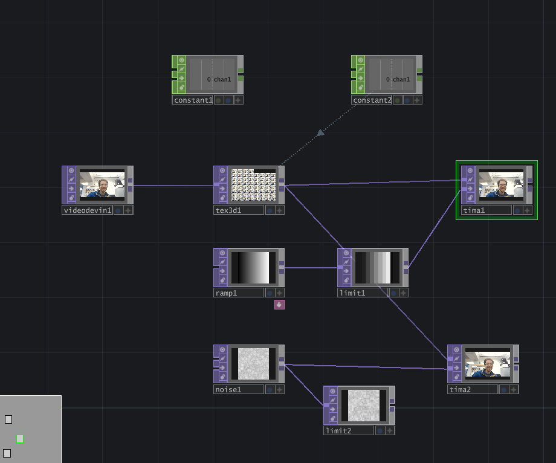
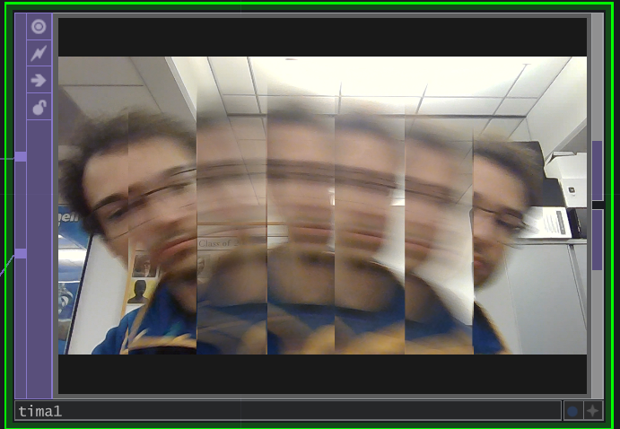

# lab08-touchdesigner

Avi Serebrenik

This is a quick, simple Touch Designer project where I manipulate the input camera video with a time offset and either a floored ramp value or a noise function.

**The full TD nodes:**

**The Ramp displacement:**

**Noise displacement:**

